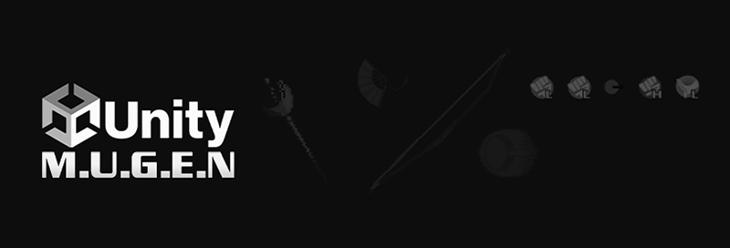

[](https://github.com/humbertodias/unity-mugen/actions/workflows/release.yml)

# UnityMugen




<p align="center">
  <a href="https://discord.gg/cWFA4kzqfb">
  
  </a>

  <a href="https://github.com/levelalfaomega/UnityMugen/graphs/contributors" alt="Contributors">
  
  </a>
  
  <a href="https://github.com/levelalfaomega/UnityMugen/pulse" alt="Activity">
  
  </a>
</p>


O Project ports Mugen mechanics to Unity.

Visit the [Documentation](https://levelalfaomega.gitbook.io/unity-mugen/).

Or reach out [in the Discord](https://discord.gg/cWFA4kzqfb).

To see tutorials visit the [youtube channel](https://www.youtube.com/channel/UCh6gZU6HF12FPnp492XRabA).

## Status 
The project is still in development and the next updates will be handled in the following tasks:
- [x] Arcade Mode
- [ ] Story Mode
- [x] Versus Mode
- [x] Trainner Mode
- [x] PostProcessing
- [x] Command List
- [x] Input System - Joystick - Keyboard
- [ ] Netcode System

## 💻 Prerequisites

Current status at a glance:
```
Unity version: 2019.4.40f1
Platforms    : Windows and Linux
```


## 🚀 Installation

1 - Download and install the [Unity Hub](https://unity.com/download).

2 - Install the recommended version [Unity 2019.4.40](https://unity.com/releases/editor/archive)

3 - Download the [repository](https://github.com/levelalfaomega/TesteUnity).

4 - 😄 Open project with Unity Hub.


## 📝 License
This project is under license. See the [LICENSE](LICENSE) file for more details.


[⬆ Voltar ao topo](#UnityMugen)<br>


<div align="center">
  <br/>
  <br/>
  <br/>
    <div>
      <h1>Open Source</h1>
      <sub>Copyright © 2023 - <a href="https://github.com/levelalfaomega">levelalfaomega</sub></a>
    </div>
  <br/>
</div>
